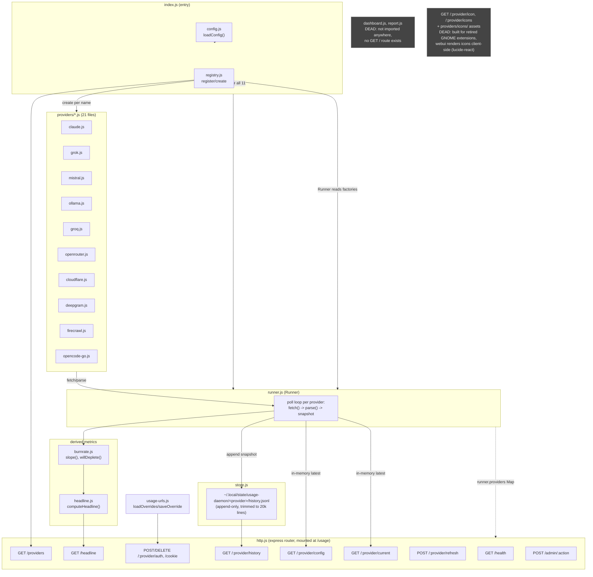

# usage-daemon architecture

Verified against actual imports and route registrations in `src/` (not inferred from comments) as of 2026-08-08.

## Dead code (post GNOME-extension-retirement)

Both confirmed by grepping every consumer in this repo, `usage-web-ui`, and the still-active `claude-usage-extension` (separate repo, doesn't talk to the daemon at all):

- **`dashboard.js` + `report.js`** — zero import references anywhere. `index.js` has the `createServer` import commented out and no `app.get('/')` route exists. The `http.js` header comment claiming `GET /` serves these is stale.
- **`GET /:provider/icon`, `GET /:provider/icons`, `findIconFile()`, `listIconVariants()`, `providers/icons/` (12 asset files)** — built to serve icon files to the retired GNOME Shell panel extensions. `usage-web-ui` renders provider icons client-side via `lucide-react` (`App.tsx:48`) and never calls these routes.

Everything else in the diagram is live — confirmed against actual `fetch()` calls in `usage-web-ui/src/client/{App,SettingsView}.tsx`.

Not yet removed; this doc is the record of what's safe to cut when that cleanup happens.
